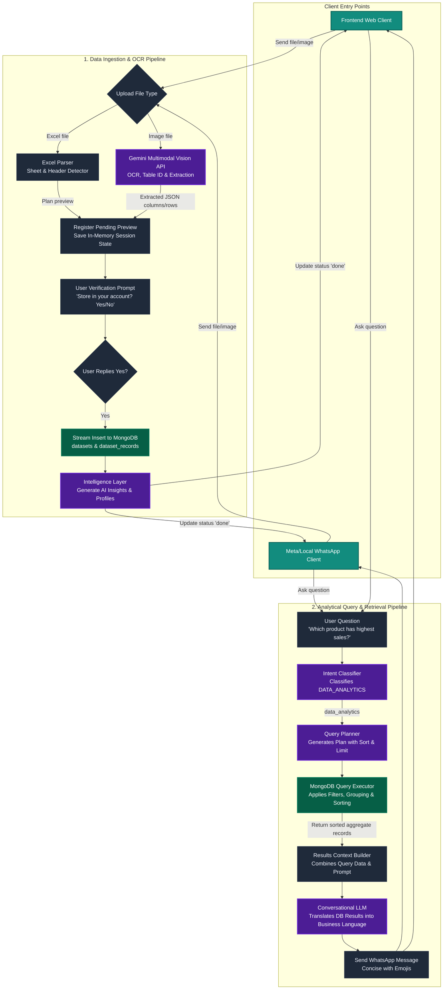

# Implementation Plan - Image Extraction & Query Sorting Hardening

## Architecture Diagram

We will implement the end-to-end image upload parsing pipeline and resolve database query planning errors.

Specifically, we will address:
1. **Query Plan Hardening:** Ensure queries requesting "highest", "lowest", "top", or "best" items (e.g., *"Which product has highest sales?"*) execute correctly by adding sorting capabilities (`$sort` stage) to the MongoDB query execution engine.
2. **Image Ingestion Pipeline:** Implement the complete flow:
   `Image Upload (HTTP/WhatsApp) ➔ Multimodal Table Identification & OCR (Gemini) ➔ Schema Inferred ➔ User Verification Prompt ➔ Database Storage ➔ Frontend Dashboard URL`

---

## User Review Required

> [!IMPORTANT]
> - **Gemini Multimodal Activation:** We will use the `gemini-2.5-flash` model for visual OCR and structured table extraction from images.
> - **Unified Confirmation Path:** The existing `/upload/confirm` endpoint and WhatsApp confirmation handlers will be modified to support both raw Excel buffers and pre-extracted image rows.
> - **Automated Aggregation Sorting:** When grouped queries are run (e.g. grouping sales by product), the MongoDB engine will default to sorting descending (`result: -1`) to naturally surface top performers without LLM instruction.

---

## Proposed Changes

### 1. Hardening Query Plans & Execution (`db.js` & `intelligence.js`)
- **Query Planner Casing & Sort Schema:** Update the system prompt in `intelligence.js` to allow the LLM to specify a `sort` key (`{ "field": "result" | "groupBy", "order": -1 | 1 }`).
- **MongoDB Aggregation Sorting:** Modify `executeQueryPlan` in `db.js` to insert a `$sort` stage in the pipeline based on the plan's sort key, falling back to sorting by `result: -1` when a `groupBy` and aggregation are present.

### 2. End-to-End Image Ingestion Pipeline
- **Multimodal Extraction (`intelligence.js`):** Add `extractTableFromImage(buffer, mimeType)` to send the image base64 data to Gemini and return structured JSON columns and rows.
- **Frontend upload endpoint (`server.js`):**
  - Update `POST /upload` to intercept image files, run Gemini extraction, construct a unified `pendingUploadPlan` in the session, and reply with the preview columns and confirmation query.
  - Update `POST /upload/confirm` to insert pre-extracted rows directly in batches of 200 for images, bypassing the excel-streaming (`streamSheet`) path.
- **WhatsApp client (`whatsapp.js`):**
  - Add support to download received images, extract tables using Gemini, and set `session.pendingPreview = { isImage: true, rawRows: [...], ... }`.
  - Update the "Yes" confirmation handler to save image rows directly in batches.
- **Meta Webhook (`meta-whatsapp.js`):**
  - Intercept Meta image webhook attachments, call Gemini table extraction, and register the pending preview.
  - Update the "Yes" confirmation handler to save image rows directly in batches.

---

## Proposed Edits

### [MODIFY] [intelligence.js](file:///c:/Projects/Ecommerce/intelligence.js)
- Add the `GoogleGenerativeAI` client and the `extractTableFromImage` helper.
- Update the `buildQueryPlan` system prompt to include the `sort` schema field.

### [MODIFY] [db.js](file:///c:/Projects/Ecommerce/db.js)
- Add sorting step in the `executeQueryPlan` aggregation pipeline.

### [MODIFY] [server.js](file:///c:/Projects/Ecommerce/server.js)
- Update `/upload` to support image files via Gemini extraction.
- Update `/upload/confirm` to write pre-extracted rows directly to MongoDB.

### [MODIFY] [whatsapp.js](file:///c:/Projects/Ecommerce/whatsapp.js)
- Parse image messages via `handleImageMessage` and register the preview.
- Support saving image rows directly on confirmation.

### [MODIFY] [meta-whatsapp.js](file:///c:/Projects/Ecommerce/meta-whatsapp.js)
- Support image media downloads, run Gemini table extraction, and register previews.
- Support saving image rows directly on confirmation.

---

## Verification Plan

### Automated / Manual Tests
1. **Query Sorting Test:** Upload `08 E-Commerce Orders.xlsx` and ask *"Which product is having more orders?"* or *"What product has highest sales?"*. Verify that the bot returns the correct sorted product name and count.
2. **Image Parsing Test:** Upload a clear image containing a table or receipt (via frontend or WhatsApp).
   - Verify that the bot responds with the detected columns and asks: *"Should I store this data in your account?"*
   - Reply *"Yes"* and verify that the data is saved in MongoDB, and the frontend dashboard URL is generated.
   - Open the live dashboard and verify that the extracted table and records are visible.
